#　額 

## 20200701

- 額に入れた。

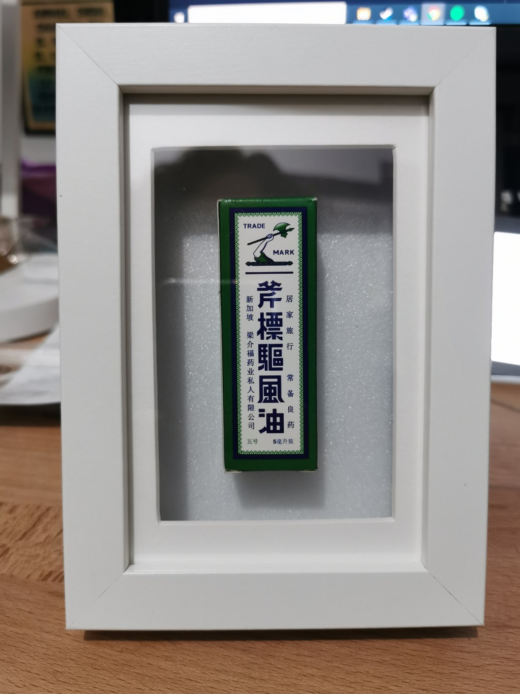

## 20200702

- 光らせた。

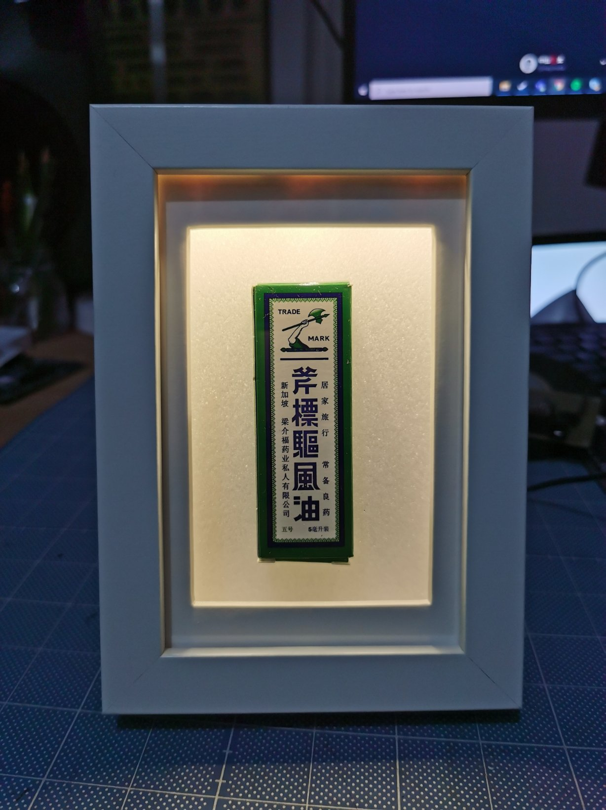

## 20200703

- 明滅させた。

 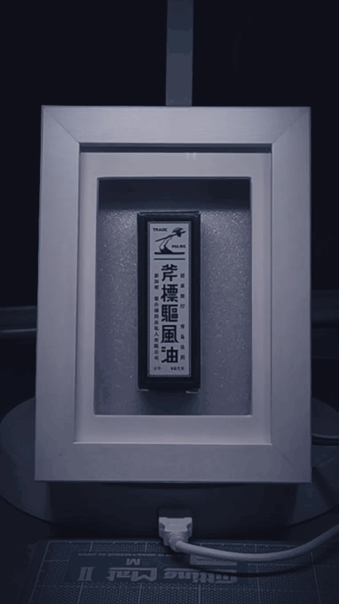

## 20200704

- 色を変えた。

 

## 20200705

- 環境色を変えた。

 

## 20200706

- やや大きくした。

 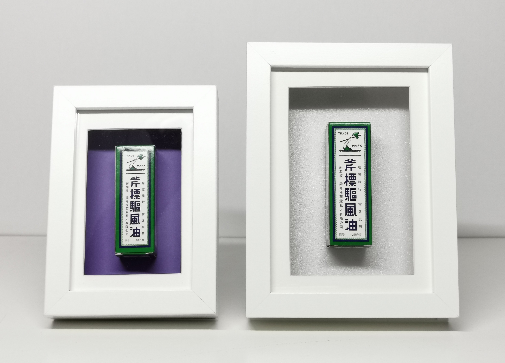

## 20200707

- 回転させた。

 

## 20200708

- 高速明滅させた。

 
 
## 20200709

- 額に入れた。

 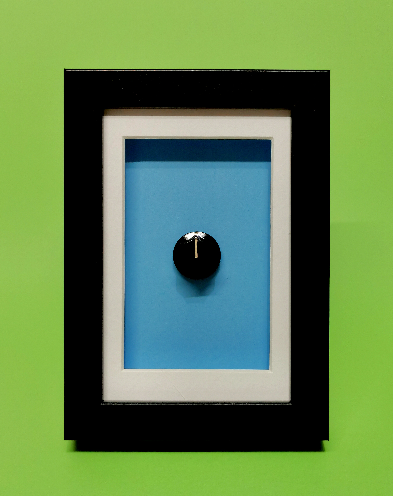

## 20200710

- 額に入れた。

 

## 20200712

- 繋いでみた。

 
 
## 20200713

- 展開した。

 

## 20200714

- 仮想化した。

 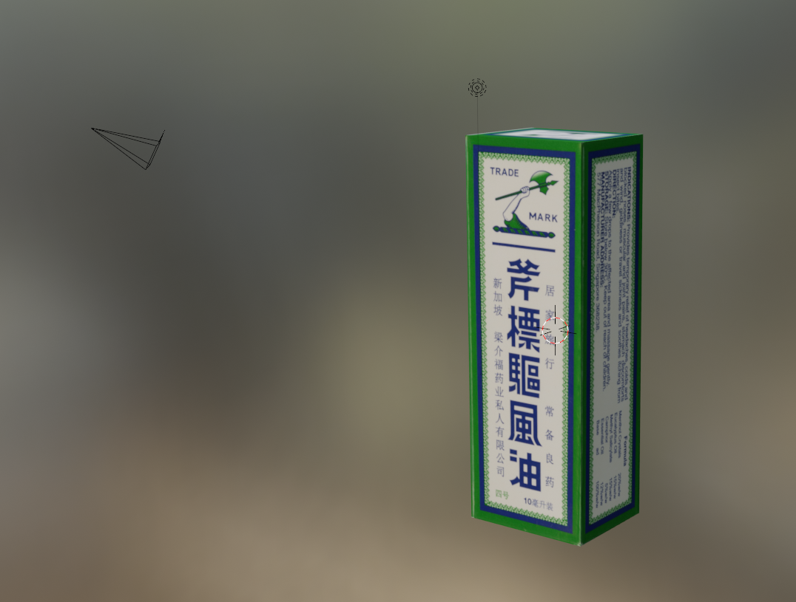

## 20200715

- 回した。

 ** [Three.js](https://threejs.org/)

 ** [tutorial](https://www.youtube.com/watch?v=8jP4xpga6yY)

 

## 20200717

* 回した修正版。

** [https://nkymut.github.io/nanika/data/20200715/Three/03_model/index.html](https://nkymut.github.io/nanika/data/20200715/Three/03_model/index.html)

## 20200718

* モデリングした。

 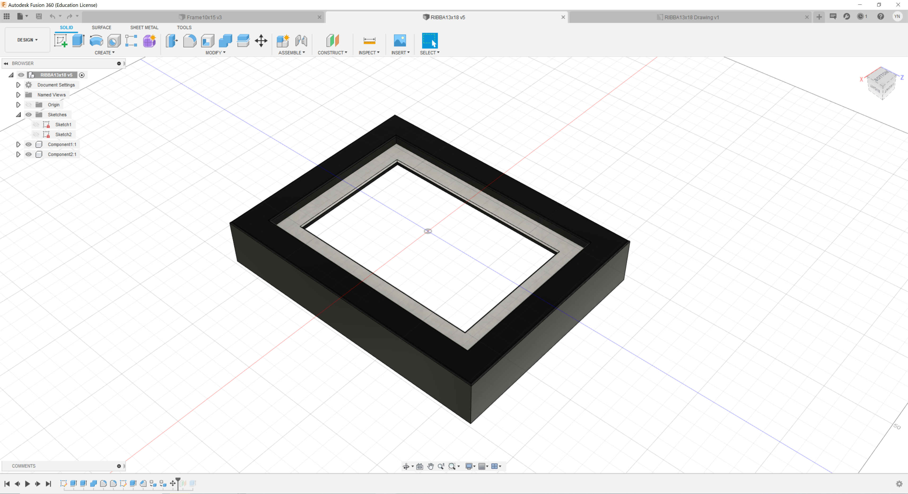

## 20200720

* 画面化した。

 

## 20200721

* 色分解した。

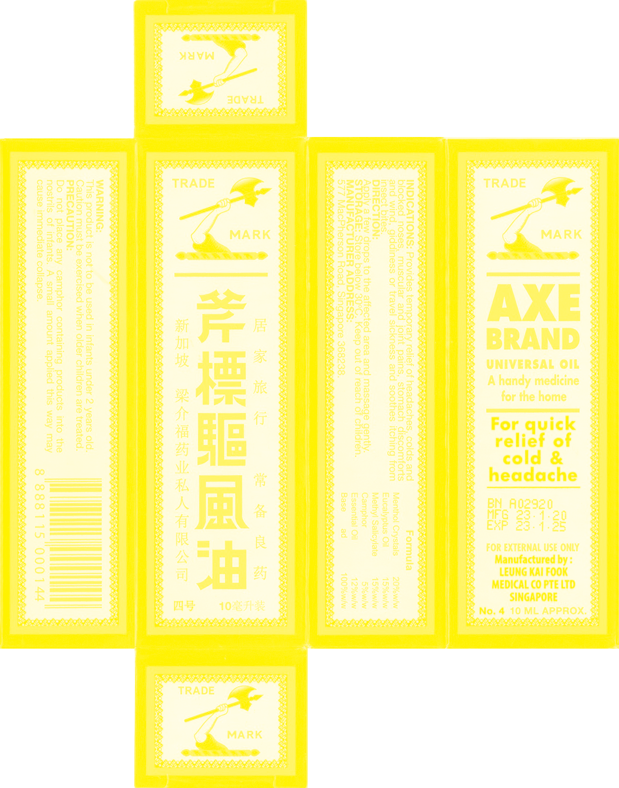

## 20200722

* テクスチャ貼り直した。

<iframe frameborder="no" border="0" marginwidth="0" scrolling="no" marginheight="0" width="80%" src="https://nkymut.github.io/nanika/data/20200722/02_texture/index.html"></iframe>

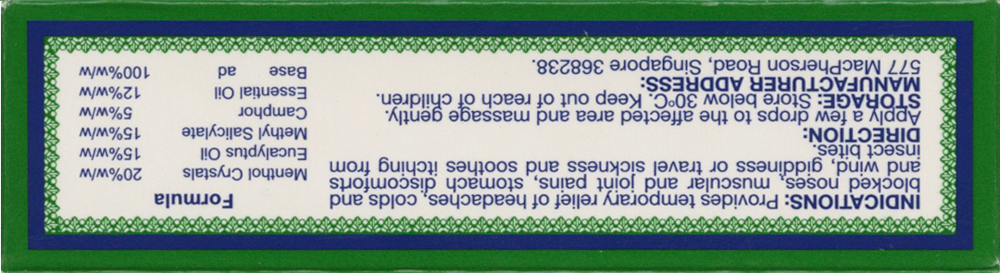

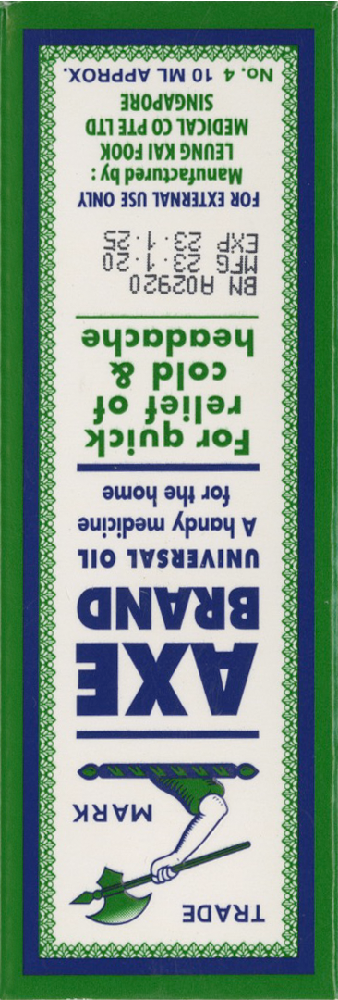
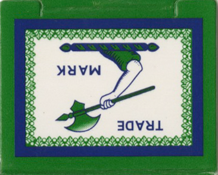

## 20200724 Day20

* [WebUSB](https://webusb.github.io/arduino/demos/rgb/)接続した。

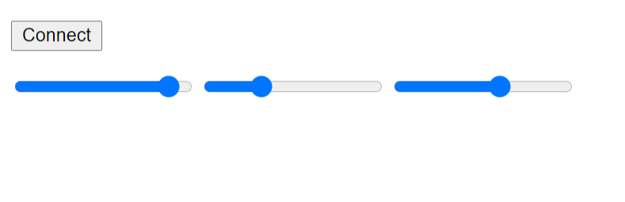

## 20200728 Day21

* 光をあてた。

<iframe frameborder="no" border="0" marginwidth="0" scrolling="no" marginheight="0" width="80%" src="https://nkymut.github.io/nanika/data/20200728/04_shadow/index.html"></iframe>

